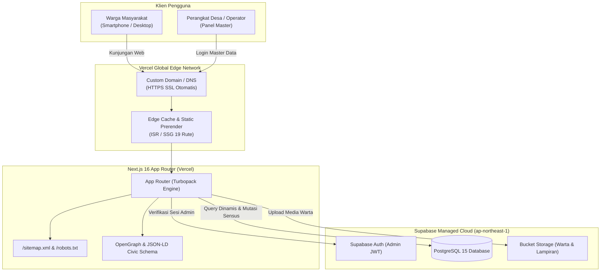

# Peta Arsitektur & Deployment: Portal Resmi Desa Kadurama

Dokumen ini memetakan arsitektur deployment produksi situs **Pemerintah Desa Kadurama, Kecamatan Ciawigebang, Kabupaten Kuningan**, konfigurasi Vercel, integrasi Supabase, kepastian status backend, serta optimasi SEO & performa *mobile-desktop*.

---

## 1. Ringkasan Eksekutif & Status Komponen

| Komponen | Platform / Provider | Status | Catatan |
| :--- | :--- | :--- | :--- |
| **Frontend & UI** | **Vercel** (Next.js 16 App Router) | **AKTIF (PRODUKSI)** | Host domain kustom, Turbopack build, CDN Global edge. |
| **Database & Auth** | **Supabase Managed Cloud** | **AKTIF (PRODUKSI)** | PostgreSQL 15, Supabase Auth (JWT), RLS, Bucket Storage. |
| **Backend Express (`backend/`)** | Node.js / Express | **PENSIUN (DEPRECATED)** | **Tidak digunakan & tidak perlu di-host terpisah.** |

---

## 2. Mengapa Backend Express Tidak Dipakai?

Folder `backend/` dibuat pada fase *scaffolding* awal. Seiring migrasi penuh ke Next.js 16 App Router dan Supabase:

1. **Direct Secure Integration (`@supabase/ssr`):**  
   Next.js berkomunikasi langsung secara aman dengan Supabase melalui SDK resmi client/server. Tidak dibutuhkan *middleware* server Express sebagai perantara (*man-in-the-middle*).
2. **Biaya & Pemeliharaan Nol Server (Zero-DevOps):**  
   Menghindari kebutuhan menyewa atau memelihara VPS / PaaS terpisah (seperti Railway, Render, atau Heroku) khusus untuk Node.js.
3. **Latensi Lebih Rendah:**  
   Permintaan data dari browser pengguna atau Vercel Edge Server langsung diarahkan ke *Connection Pooler* Supabase (Tokyo, AWS `ap-northeast-1`), memangkas 1 *hop network* tambahan.
4. **Keamanan Setara Perbankan:**  
   Autentikasi dikelola langsung oleh Supabase Auth menggunakan token JWT terenkripsi dan kebijakan *Row Level Security* (RLS) di level database PostgreSQL.
5. **Skalabilitas Tak Terbatas:**  
   Vercel Serverless Function dan Supabase menangani lonjakan trafik secara otomatis tanpa risiko *server crash* atau *memory leak*.

> [!TIP]
> Folder `backend/` dapat diabaikan saat deployment. Vercel hanya perlu mengarah ke direktori `frontend`.

---

## 3. Topologi Arsitektur (Diagram Arsitektur)



---

## 4. Konfigurasi Dashboard Vercel

Saat menghubungkan repositori Git ke Vercel, pastikan konfigurasi proyek disetel sebagai berikut:

### A. Project Settings
- **Framework Preset:** `Next.js`
- **Root Directory:** `frontend` *(Sangat krusial: Vercel hanya mem-build folder frontend)*
- **Build Command:** `npm run build`
- **Output Directory:** `.next` (otomatis)
- **Install Command:** `npm install`
- **Node.js Version:** `20.x` atau `22.x`

### B. Environment Variables di Vercel Dashboard
Tambahkan variabel berikut pada menu **Project Settings → Environment Variables**:

| Variable Name | Nilai Produksi | Deskripsi |
| :--- | :--- | :--- |
| `NEXT_PUBLIC_SUPABASE_URL` | `https://knriykfmhjyaxxhpbgrc.supabase.co` | URL endpoint API Supabase proyek Kadurama. |
| `NEXT_PUBLIC_SUPABASE_ANON_KEY` | `eyJhbGciOiJIUzI1NiIsIn...` *(dari .env.local)* | Kunci anonim publik dengan RLS aktif. |
| `SUPABASE_SERVICE_ROLE_KEY` | `eyJhbGciOiJIUzI1NiIsIn...` *(dari .env.local)* | Kunci rahasia server (hanya untuk server-side tasks). |
| `NEXT_PUBLIC_SITE_URL` | `https://domain-desa-anda.com` | URL domain produksi untuk sitemap & canonical SEO. |

---

## 5. Optimasi SEO & Performa (Mobile & Desktop)

Situs telah dilengkapi fitur *best practices* modern:

1. **Automated Dynamic Sitemap (`/sitemap.xml`):**
   - Berkas `frontend/src/app/sitemap.ts` otomatis merender indeks semua halaman utama (Profil, Sejarah & Visi Misi, Kependudukan Dusun, APBDes, Layanan Surat) serta rute dinamis artikel warta dari database.
2. **Pengendali Perayap Otomatis (`/robots.txt`):**
   - Berkas `frontend/src/app/robots.ts` mengizinkan seluruh halaman publik diindeks oleh Googlebot, sembari memproteksi rute privat seperti `/master` dan `/login`.
3. **Structured Data JSON-LD (`schema.org/GovernmentOrganization`):**
   - Ditanamkan di `frontend/src/app/layout.tsx` sehingga Google Search mengenali situs sebagai entitas resmi kantor desa, lengkap dengan koordinat geolokasi, jam buka loket, logo resmi Pemkab Kuningan, dan alamat kantor.
4. **Optimasi Tipografi & Layout Shift (CLS = 0):**
   - Menggunakan `next/font/google` dengan `Plus_Jakarta_Sans` dan `display: 'swap'`, menghilangkan FOIT (*Flash of Invisible Text*) dan menurunkan CLS ke tingkat optimal.
5. **Code Splitting & Lazy Loading:**
   - Komponen peta Leaflet GIS (`CivicGisMap`) dimuat dinamis dengan `next/dynamic` (`ssr: false`), menjaga ukuran bundel awal (*First Load JS*) tetap ringan untuk perangkat mobile dengan sinyal terbatas.

---

## 6. Prosedur Rilis & Deployment Berkelanjutan (CI/CD)

1. **Otomatisasi Git Push:**
   Setiap commit ke branch `main` pada repositori GitHub akan memicu *automatic preview/production build* di Vercel dalam rentang 40-60 detik.
2. **Verifikasi Build Mandiri Sebelum Push:**
   ```bash
   cd frontend
   npm run build
   ```
   Pastikan seluruh 19 rute menghasilkan status prerender statis (`○`) atau dinamis (`ƒ`) tanpa peringatan TypeScript.
